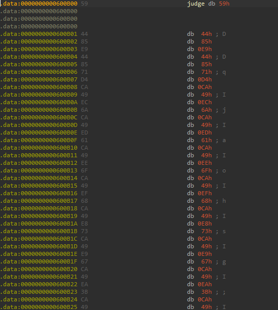
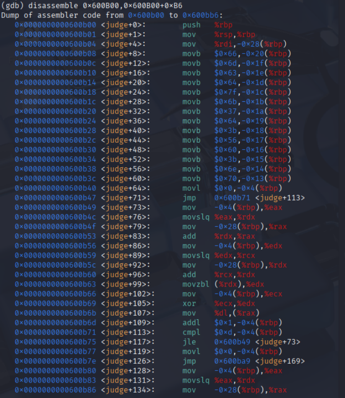

# 当把数据段里的当做函数call时

> 比如ida识别到 `(*(int (__fastcall **)(char*))unk)(x)` 
然而跟进unk进去发现只有一大堆`db xx`之类的

> 此时就需要将这些数据先当作汇编代码处理，再进行`F5`:convert to pseudocode

一个例子：


跟进judge发现是这些
但是main函数里面有`(*(unsigned int (__fastcall **)(char *))judge)(s)`
说明judge是藏在数据段里面的代码

## ida里面的步骤：
1. 鼠标聚焦judge 按c（convert to code）；
2. 全选judge段 按p （make function），让ida识别到这个函数，以便F5；
3. F5

## gdb里面的操作

> 如果觉得上面的太无脑，想稍微高级一点，可以在gdb中执行以下指令

```gdb
disassemble 0x600B00,0x600B00+0xB6

或者

x/182xb 0x600B00 ; 这里我的汇编代码长度182个字节，起始地址为0x600B00
```



结果就是这样，如果想锻炼读汇编的能力，可以试试这种方式